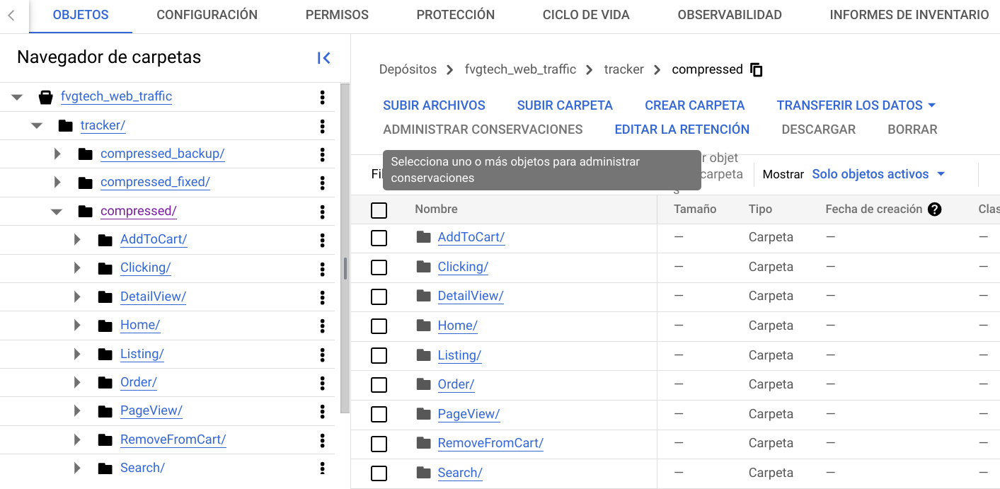

# Data funnel web

12/04/2024
## Objetivo

El objetivo de el funnel es representar de manera cómoda y detallada información sobre el comportamiento web de los clientes en la página de Frávega haciendo uso del tracker diseñado exclusivamente para ese uso, para esto daremos una explicacion una explicación general sobre como se obtiene y procesa la data que finalmente es depositada en **BigQuery** para ser levantada y graficada en un cubo **Microstrategy**. 


## Introducción tracker

El tracker web fue un desarrollo de del equipo de Julian Alonso, el cual levanta data de la web de Frávega y se encarga de enviarla a una serie de buckets en [Cloud Storage](https://console.cloud.google.com/storage/browser/fvgtech_web_traffic/tracker/staged;tab=objects?hl=es&prefix=&forceOnObjectsSortingFiltering=false&authuser=0). Estos buckets contienen distintas etapas de la data, ya sea la data en tiempo real, la data en estado staged y la que se utilizó particularmente en esta version, la data a dia cerrado que recibe el nombre de compressed (dado que se encuentra comprimida), veamos un ejemplo de la jerarquia:



Es necesario dar una breve introducción sobre dichos eventos:

* PageView: Es el evento que captura las urls de entrada y de salida asi como la metadata de la pagina como el dispositivo del cual se conecto el cliente, si llego de una campaña de marketing, etc. 
* DetailView: Este evento corresponde solamente al acto de observar un producto en particular, captura información como el producto que se esta observando, su precio, codigo de articulo,etc.
* AddToCart: Registra el acto de agregar un producto al carrito.
* RemoveFromCart: Registra  la eliminación de un producto del mismo.
* Order: Registra las ordenes de compra. Posee la particularidad de que si una compra se llega a caer, no registra la caida de esa compra, por lo que si bien posee ese detalle, es una cantidad muy pequeña.
* El resto de los eventos, si bien hay algunos importantes como listig, no fueron utilizados de momento.


Cada una de las carpetas en compressed corresponde a alguno de los eventos previamente comentados y dentro de ellas se encuentran los archivos comprimidos para cada dia y para cada horario en intervalos de 1 hora veamos un ejemplo de esto:


## Toma de los datos

Dada la jerarquida en la que tracker guarda los datos, se creo una libreria llamada `data_extraction`, la cual desde una notebook de **Vertex AI** se conecta a dicho bucket y levanta para un intervalo de tiempo arbitrario, la data de un set arbitrario de eventos, veamos un ejemplo de su uso:

``` python
# # Ejemplo de uso:
project_id = 'fvgtech-prd-analytics'
gcs_bucket = 'fvgtech_web_traffic'
start_date = datetime(2024, 3, 11)
end_date = datetime(2024, 3, 15)
eventos = ['PageView', 'DetailView','AddToCart','RemoveFromCart']  # Lista de eventos a procesar

blob_processor = BlobProcessor(project_id, gcs_bucket)
df = blob_processor.process_blobs(start_date, end_date, eventos)
display(df.head(),df.shape)
```
Dicha libreria busca obtener de manera arbitraria un subset relevante para el analisis de toda la informacion disponible en tracker los componentes principales de dicho subset son, para cada evento:
- PageView
  - session_id
  - cookie_id
  - referrer
  - base_url
  - original_url
  - ingestionTimestamp
  - clientTimestamp
  - utm_medium
  - utm_campaign
- DetailView
  - device
  - event_type
  - price
  - cod_articulo
  - geoAvailability_Availability
  - homeDelivery_Availability
  - homeDelivery_label
  - categorization
- AddToCart
  - Solo se trae la data para contar cuantos eventos hubo para cada session_id
- RemoveFromCart
  - Solo se trae la data para contar cuantos eventos hubo para cada session_id
- Orders:
  - Solo se trae la data para contar cuantas ordenes hubieron  para cada session_id. 

## Procesado de los datos


## Mapeo de columas de salida
Al dia de la fecha, el dataset de salida cuenta con 111 columnas, antes de ver sus definiciones, repasemos los eventos
repasemos las definiciones de cada grupo de ellas por grupos a los que pertenecen, 


- 
